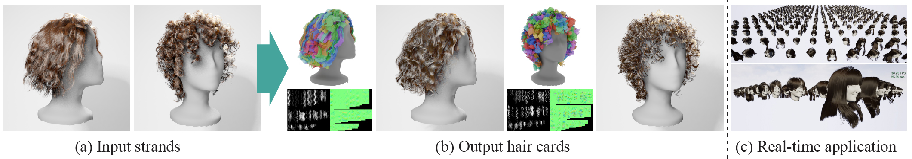

# Strands2Cards: Automatic Generation of Hair Cards from Strands [SIGGRAPH Asia 2025]



[Kenji Tojo](https://kenji-tojo.github.io/),
[Liwen Hu](https://scholar.google.com/citations?user=Mvq6pGcAAAAJ&hl=en),
[Nobuyuki Umetani](https://cgenglab.github.io/en/authors/admin/),
[Hao Li](https://www.hao-li.com/Hao_Li/Hao_Li_-_about_me.html)<br>
*SIGGRAPH Asia 2025 (Conference Track)*

[Paper](https://www.dropbox.com/scl/fi/thidrqw3c58mn1ju2a8qr/sa25_strands2cards.pdf?rlkey=a1euz6cii69vp12yr1wmj240v&st=8l3jf3fr&dl=0) |
[Video](https://www.dropbox.com/scl/fi/4re0pe8f2b8u6p16egff3/sa25_strands2cards_video.mp4?rlkey=jo9x1a78clykmupdknc4plb4d&st=120pxgbx&dl=0)


## Cloning the repository

```bash
git clone --recursive git@github.com:kenji-tojo/strns2cards.git
cd strns2cards
```

## Platform compatibility

This project has been tested on **Windows 11** and **Python 3.10.11** using the installation and runtime steps described below.

## Resolving dependencies
Create and activate a virtual environment with Python 3.10. For example, you can run:

```bash
python3.10 -m venv venv
venv\Scripts\activate
```


First, install PyTorch with CUDA 12.4 by following the instructions on the official website:
https://pytorch.org/get-started/locally/

In our case, we installed it using the following command:

```bash
pip3 install torch torchvision --index-url https://download.pytorch.org/whl/cu124
```

Then install `largesteps`:
```bash
set PYTHONUTF8=1
pip3 install largesteps
```

Finally, install the rest of the dependencies:
```bash
pip3 install -r requirements.txt
```

## Building the `pystrns2cards` module
The following commands let you install our PyTorch extension.
This build process was tested on Windows 11 using:
- MSVC: Microsoft Visual Studio 2022 (MSVC 19.42.34435.0)
- CUDA Toolkit: CUDA 12.4
- NVCC: NVIDIA NVCC 12.4.99

```bash
cd pystrns2cards
mkdir build
cd build
cmake .. -DCMAKE_BUILD_TYPE=Release
cmake --build . --config Release
```

## Downloading the input data
We provide a ZIP archive containing pre-processed data derived from the CT2Hair project (https://github.com/facebookresearch/CT2Hair).  
Our changes are minimal — we only aligned the head model with the hair model and adjusted the unit scale for compatibility.  
All credit for the original dataset belongs to the CT2Hair authors.

Please download the ZIP file from the following URL:

https://www.dropbox.com/scl/fi/jun752zk4srgvu2tywdw8/dataset.zip?rlkey=5o7qqjotf5jd6sibs022r5x2j&st=lvdv1ob2&dl=0

After downloading, extract the contents so that the dataset directory is placed at ```./dataset/```.


## Running the conversion code
The conversion of a hair strand model into a hair card model is performed using the following three scripts. These scripts save results under the ```./output/``` folder.
```bash
python 1_cluster.py
```
```bash
python 2_texture.py
```
```bash
python 3_fitting.py
```

We then export the mesh to the FBX format so it can be loaded from Unreal Engine. We performed this conversion using ```Blender 4.3.2```.
```bash
blender -b -P 4_export_obj2fbx.py
```

## Rendering the output
We provide an Unreal Engine–based renderer for visualizing the generated hair card models:

https://www.dropbox.com/scl/fi/k6ae0q0l85hx9tukr41lf/Renderer_v1.zip?rlkey=0w1ug2bdvnna9kaf4jsso8go9&st=0hmady3i&dl=0

Please download and extract this archive to access the Unreal project and associated scripts.

TODO: add more detailed usage instructions.


## Optional speed-up
If `libKMCUDA` is installed in the environment (see https://github.com/src-d/kmcuda), the clustering script (`1_cluster.py`) will automatically detect it and use the CUDA-accelerated k-means implementation, providing more efficient clustering for large numbers of strands.


## Citation
```
@inproceedings{Tojo2025Strands2Cards,
	author = {Tojo, Kenji and Hu, Liwen and Umetani, Nobuyuki and Li, Hao},
	title = {Strands2Cards: Automatic Generation of Hair Cards from Strands},
	booktitle = {ACM SIGGRAPH Asia 2025 Conference Proceedings},
	year = {2025},
	series = {SIGGRAPH Asia '25},
	doi = {10.1145/3757377.3763864}
}
```
